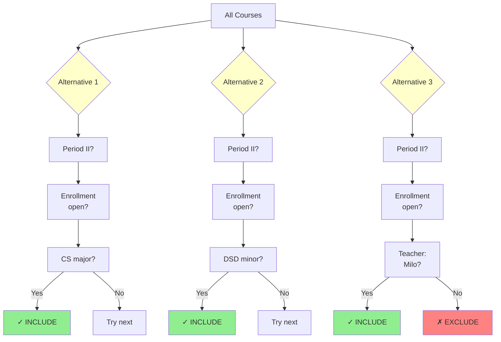
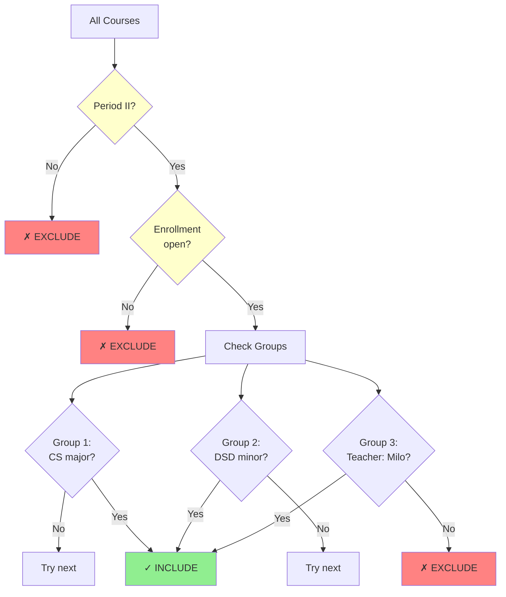
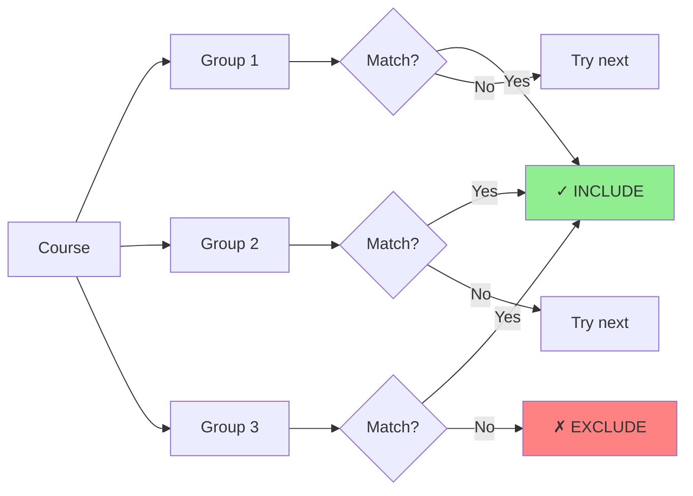
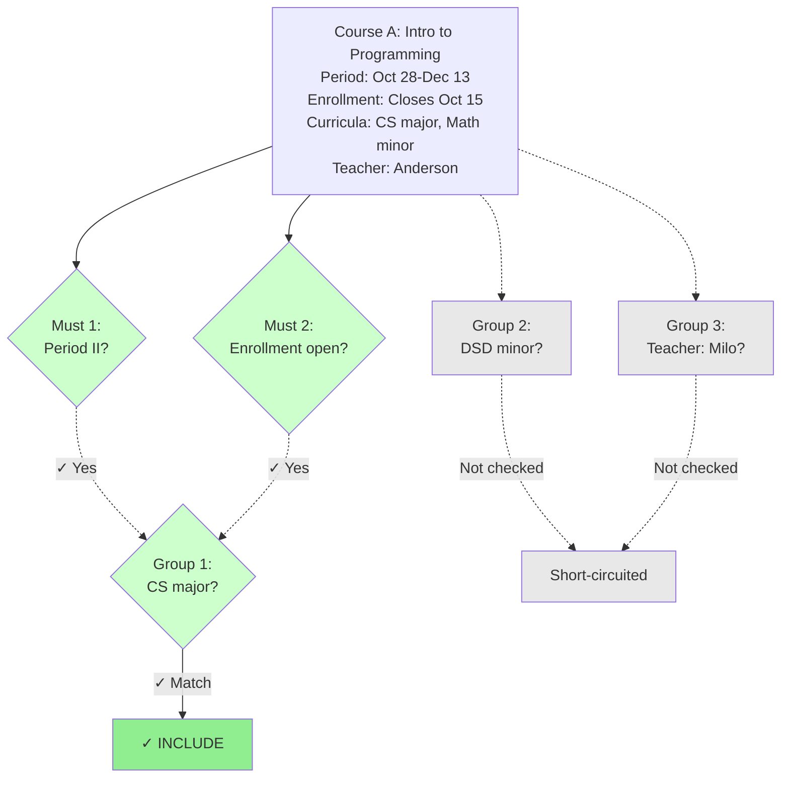
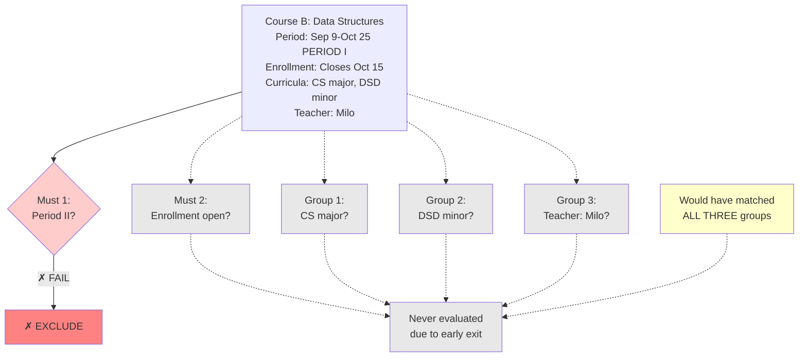
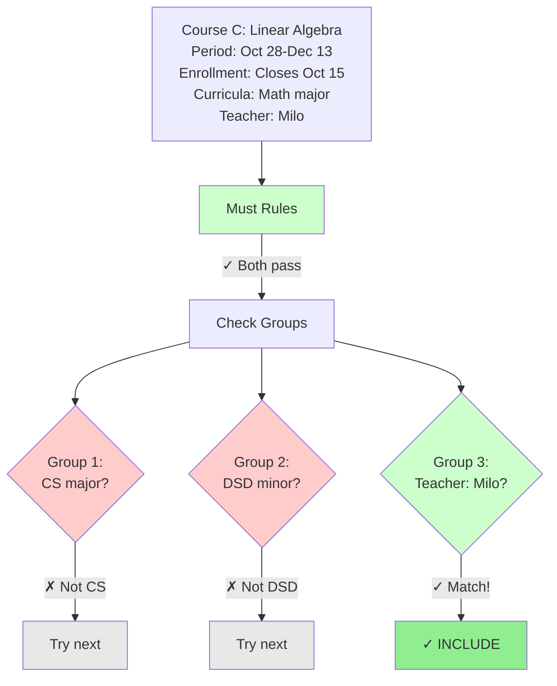
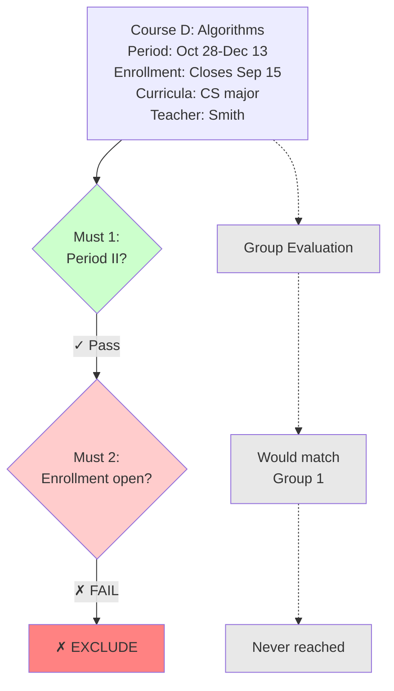
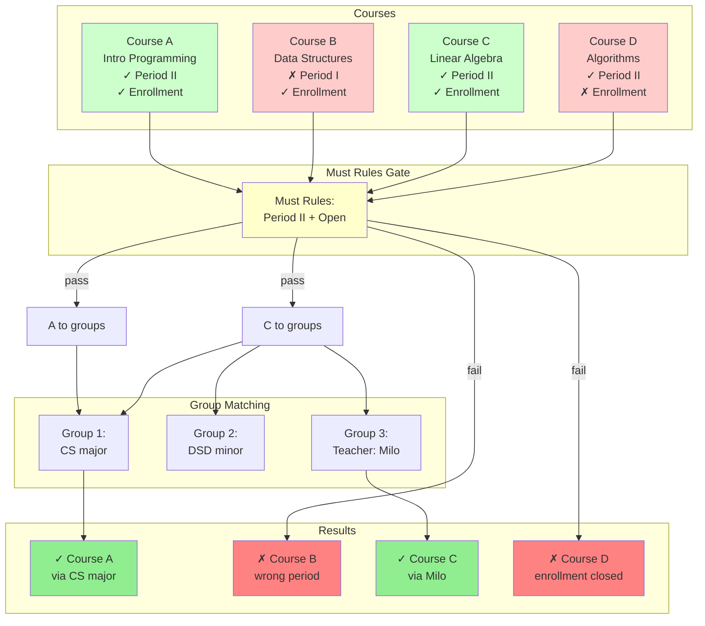

# How We Filter, A Conceptual Model

## The Fundamental Problem

Consider a typical course search scenario:

> **Example requirement:** *"I want courses that start in Period II and are open for enrollment. From those, I'm interested in courses that count toward my CS major, or courses in my DSD minor, or anything taught by Milo."*

This requirement contains:
- **Universal constraints** (Period II, enrollment open)  
non-negotiable requirements
- **Multiple alternatives** (CS major OR DSD minor OR Milo's courses)  
any single option satisfies the need
- **Different comparison types** (temporal overlap, set membership, text matching)  
each requiring distinct evaluation logic

Traditional interfaces force users to either oversimplify their requirements or master complex query languages. This model provides structured flexibility that accommodates complexity while remaining comprehensible.


## Core Concepts

### The Two-Tier Architecture

Filtering requirements naturally decompose into two distinct components.

First, establish the filtering context: "Show me Period II courses that are open for enrollment."

Then, define selection criteria within that context: "From those, give me my major courses, or my minor courses, or anything from Milo."

> [!TIP]
> **Why Two Tiers?**  
> Without this separation, universal constraints must be repeated in every alternative. The two-tier structure mirrors natural reasoning: establish boundaries first, then specify what qualifies within those boundaries.

**Without this separation, constraints are repeated:**



```
Match any of:
  - (Period II AND Enrollment open AND CS major)
  - (Period II AND Enrollment open AND DSD minor)
  - (Period II AND Enrollment open AND Teacher: Milo)
```

Note how "Period II AND Enrollment open" appears three times, creating redundancy and potential for inconsistency.

**With two-tier structure:**



```
Must satisfy: Period II AND Enrollment open
Then match any of:
  - CS major
  - DSD minor
  - Teacher: Milo
```

The universal constraints define the **filtering context**. The alternative patterns describe **what qualifies** within that context.

### Must Rules: Universal Requirements

Must rules represent non-negotiable requirements. They answer: *"What must be true about every course I see?"*

No exceptions, no alternatives, no conditional application. Failure to satisfy even one must rule results in immediate exclusion.

Each must rule $M_i$ is a boolean function like any other rule. What makes it "must" is not its structure, but how it's applied—universally, to every course:
```katex
M_i(x) : x \rightarrow \{0, 1\}
```

For a course $x$ to be considered, all must rules must evaluate to true:
```katex
M_1(x) \land M_2(x) \land \cdots \land M_n(x) = 1
```

> [!IMPORTANT]
> **Must Rules Are Absolute**  
> Failure means immediate exclusion. A course might satisfy all group criteria, but if it fails a single must rule, it is excluded. These define non-negotiable boundaries.

**Key characteristics:**
- Apply to every course without exception
- All must pass (AND logic)
- Failure means immediate rejection
- Evaluated before any group logic

**Examples:**
- "All courses must overlap Period II 2024-25"
- "All courses must be open for enrollment"
- "All courses must be taught in English"

These establish boundaries within which all other selection logic operates.

### Rule Groups: Alternative Patterns

Rule groups define different acceptable qualification paths. They answer: *"What are the different ways a course can meet my needs?"*

A course might qualify through your major program, your minor program, or by being taught by a preferred instructor. Any single path is sufficient.

Between groups, OR logic applies. A course $x$ qualifies if it matches any group:

```katex
G_1(x) \lor G_2(x) \lor \cdots \lor G_k(x)
```

Each additional group expands the set of acceptable courses.

Within a group, AND logic applies. Group $j$ matches course $x$ when all its rules pass:

```katex
G_j(x) = R_1(x) \land R_2(x) \land \cdots \land R_m(x)
```

Each additional rule narrows what the group accepts.



> [!NOTE]
> **Groups Are Independent**  
> Each group evaluates independently. One group's outcome does not affect others. A course needs to satisfy only one pathway to qualify. This independence simplifies debugging: identifying which group matched explains why a course was included.

**Well-formed groups represent coherent selection criteria:**
- "My major courses" → Belongs to CS major
- "My minor courses" → Belongs to DSD minor  
- "Trusted instructor" → Teacher contains "Milo"

### Filter Rules: Atomic Conditions

Rules are the fundamental building blocks. Each one asks a single yes/no question: *"Does this specific attribute have this specific property?"*

Rules have two key properties. They're **atomic**, meaning they can't be meaningfully broken down further. They're also **independent**, meaning each evaluates on its own without depending on other rules.

**Every rule consists of three components:**

1. **Field** - *What attribute are we examining?*  
Examples: Credits, Teacher, Period
2. **Relation** - *How are we comparing?*  
Examples: Contains, Equals, Overlaps
3. **Value** - *What are we comparing against?*  
Examples: "Milo", 5, "Period II"

A rule $R$ is defined by a triple $(a, f, v)$ where:
- $a \in A$ is a field selector from the set of all course fields
- $f$ is a relation function (a boolean comparison operator)
- $v$ is the comparison value

The rule evaluates a course $x$ by extracting field $a$ from $x$, then applying the boolean relation $f$ to compare against value $v$, producing either true (1) or false (0):
```katex
R(x) = f(a(x), v) \in \{0, 1\}
```

Let's see some rules in action.

*Text matching:*
```
"Teacher contains Milo"
Course A: teacher = "Milo Orlich" → true ✓
Course B: teacher = "Jane Anderson" → false ✗
```

This performs case-insensitive substring search.

*Temporal overlap:*
```
"Period overlaps Period II 2024-25" (Oct 28 - Dec 13)
Course A: Oct 28 - Dec 13 → true ✓ (exact match)
Course B: Sep 9 - Oct 25 → false ✗ (ends before Period II starts)
```

This tests whether date ranges intersect.

*Set membership:*
```
"Belongs to CS major"
Course A: curricula = ["CS major", "Math minor"] → true ✓
Course B: curricula = ["DSD major"] → false ✗
```

This verifies whether the target appears in the set.

Different field types require different evaluation logic, but the pattern is always the same: one field, one comparison, one result.


## Evaluation Logic

### How It Actually Works

Now that we've established the components, let's see how they work together during evaluation.

Filter query evaluation proceeds through three stages:

{}
1. #### Stage 1: Universal Screening
   Every course is tested against must rules. Any failure results in immediate exclusion.

2. #### Stage 2: Group Matching
   Courses that passed Stage 1 are evaluated against rule groups. Within each group, all rules must pass. A course qualifies if any single group matches.

3. #### Stage 3: Result Collection
   All qualifying courses are collected and returned.
{}

### Evaluation Walkthrough

Consider this query:

**Query:**
```
Must Rules:
  - Period overlaps "Period II 2024-25"
  - Enrollment is open today (assume today is 2024-10-01)

Groups:
  Group 1: Belongs to "CS major"
  Group 2: Belongs to "DSD minor"
  Group 3: Teacher contains "Milo"
```

We will evaluate four courses from our database to demonstrate the evaluation process:

#### Course A - "Introduction to Programming"
```
Period: Oct 28 - Dec 13 (Period II)
Enrollment closes: 2024-10-15
Curricula: [CS major, Math minor]
Teacher: Anderson
```



Course A satisfies both must rules and matches Group 1 immediately. Groups 2-3 are not evaluated due to short-circuiting.

#### Course B - "Data Structures"
```
Period: Sep 9 - Oct 25 (Period I)
Enrollment closes: 2024-10-15
Curricula: [CS major, DSD minor]
Teacher: Milo
```

This course would satisfy all three groups. However:



> [!WARNING]
> **Must Rules Trump Everything**  
> Course B satisfies all three group criteria (CS major, DSD minor, taught by Milo). However, it fails the Period II must rule and is therefore excluded. Must rules are evaluated first and failures are absolute.

#### Course C - "Linear Algebra"
```
Period: Oct 28 - Dec 13 (Period II)
Enrollment closes: 2024-10-15
Curricula: [Math major]
Teacher: Milo
```



This course does not satisfy program requirements (Groups 1-2). However, it is taught by Milo (Group 3), which is an acceptable qualification path. Therefore, it is included.

#### Course D - "Algorithms"
```
Period: Oct 28 - Dec 13 (Period II)
Enrollment closes: 2024-09-15 (already passed)
Curricula: [CS major]
Teacher: Smith
```



Despite satisfying Group 1 criteria (CS major), this course is excluded due to must rule failure (enrollment has closed).

#### Summary View



### Short-Circuit Evaluation

Evaluation terminates early when the outcome can be determined. This optimization significantly improves performance.

Must Rules (Conjunctive Short-Circuit):
```katex
\exists i : M_i(x) = 0 \implies x \notin S
```

Rule Groups (Disjunctive Short-Circuit):
```katex
\exists j : G_j(x) = 1 \implies x \in S
```

Where $x$ represents the course being evaluated and $S$ is the result set of matching courses.

> [!TIP]
> **Performance Through Early Exit**  
> In must rules: evaluation stops at the first failure—the course is already excluded.
> In groups: evaluation stops at the first match—the course is already included.
> This typically reduces evaluations by 40-70% compared to exhaustive checking.

**In must rules:** Upon encountering the first failure, evaluation stops immediately. Further must rules need not be checked since the course is already excluded.

**In groups:** Upon finding the first matching group, evaluation stops immediately. Remaining groups need not be checked since the course already qualifies.

In practice, this optimization reduces evaluations by 40-70%. Rather than evaluating every rule for every course, evaluation terminates as soon as the outcome is determined.

## Design Principles

Having seen the model in action, let's step back and examine why it's structured this way.

### Why This Structure?

We separated must rules from groups because that's how people naturally think. You establish boundaries first ("I want Period II courses"), then get specific about what you want within those boundaries ("from my programs or from Milo").

The structure also makes it easier to:
- **Understand** what a query does (read it like natural language)
- **Debug** when something's wrong (check must rules, then check which group matched)
- **Modify** incrementally (add a new constraint, add a new alternative pattern)

### Predictability

The model maintains no hidden state. No surprising side effects. No context-dependent behavior.

> [!NOTE]
> **What You See Is What You Get**  
> Identical queries on identical data produce identical results. Rules evaluate independently. Boolean algebra properties (commutativity, associativity) apply consistently. This predictability is essential for usability.

What you see is what you get. Same query on same data always produces same results. Rules evaluate independently without side effects. Standard boolean algebra properties apply.

This predictability isn't just philosophically nice - it's what makes the model practical.

### Natural Expression

The goal is to bridge the gap between how you think about filtering and how you express it. You shouldn't need to become a query language expert to say "courses from my programs or taught by Milo."

The two-tier structure, OR logic between groups, and AND logic within groups map directly to natural language patterns. This is intentional.


> [!IMPORTANT]
> **The Core Formula**  
> The fundamental evaluation logic:
>
> ```katex
> x \in S \iff (M_1(x) \land M_2(x) \land \cdots \land M_n(x)) \land (G_1(x) \lor G_2(x) \lor \cdots \lor G_k(x))
> ```
> 
> ```katex
> \text{where } G_j(x) = (R_{j,1}(x) \land R_{j,2}(x) \land \cdots \land R_{j,m}(x))
> ```
> 
> A course $x$ is in the result set $S$ if and only if it satisfies all must rules AND at least one group.
