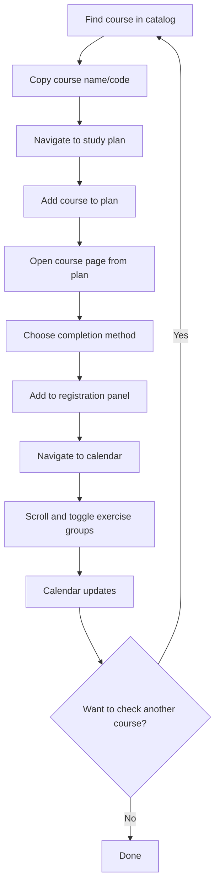
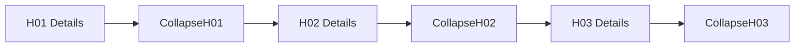

## On Friction and Frustration, The Real Barrier to Entry

Let’s be honest. SISU isn’t hard to use in the sense that you can’t figure it out. It’s just slow, rigid, and mentally exhausting. The issue isn’t about learning where to click, it’s about how much effort it takes to simply explore your options.

> [!NOTE]
> At its core, SISU follows a commitment-first model, meaning you must declare your intent before you can even peek at what that commitment looks like.

Here’s what the current flow feels like in practice:



All this, just to see when the classes are. The underlying problem is simple but aweful: you have to commit before you can explore.


#### The Psychological Barrier

And that design choice changes how students feel. The system unintentionally sends the message that every action is an official decision.

You can almost hear the internal dialogue:

- "I have to add this to my study plan just to see when it meets?"
- "What if I decide not to take it?"
- "Now I have to remove it again..."
- "It feels like I'm declaring something permanent."

> [!TIP]
> That hesitation isn’t trivial. It leads to decision paralysis. Many students end up sticking to familiar courses or asking friends instead of exploring independently. The barrier isn’t technical, it’s psychological friction disguised as bureaucracy.


#### The Technical Friction

Then there’s the mechanical side of the problem: the clicks, the scrolling, the repetition.

- Adding a course requires a full plan commitment
- Schedule details are buried in a ~300 px-wide sidebar
- Exercise groups (H01, H02, …) can’t be viewed side-by-side
- The calendar only shows one week at a time
- Comparing two courses means juggling multiple tabs
- Removing a course feels like undoing an error

It’s a textbook case of interface friction:
10 + clicks to compare two groups, multiple tabs just to compare two courses, and a constant sense that you’re wrestling with the tool instead of using it.


### What Students Actually Need

> [!NOTE]
> Most students aren’t asking for a revolution. They just want a place to experiment safely. A space where curiosity doesn’t feel like commitment.

The ideal flow looks more like this:

1. Browse interesting courses
2. Add to favorites (no commitment)
3. Instantly see all schedules in one view
4. Toggle between group options (instant update)
5. Compare courses side by side
6. Remove freely (no guilt, no confirmation prompts)
7. Only commit when ready -> Proceed to SISU

> The key is to *separate the exploration phase from the commitment phase*.


#### User Mental Model

| Concept      | SISU (Current)               | Missing Dashboard (Desired)       |
| ------------ | ---------------------------- | --------------------------------- |
| Study Plan   | Serious, official commitment | Flexible workspace                |
| Add Course   | Declaration of intent        | “Just looking”                    |
| Calendar     | My real schedule             | Sandbox for possibilities         |
| Mental Model | Bureaucratic                 | Exploratory, visual, low-friction |

This shift reframes the entire experience, from bureaucratic form-filling to creative discovery


### The Comparison Problem in SISU

> The problem is real when students try to compare exercise groups.

#### The Sidebar Bottleneck

```
Narrow Sidebar (~300px):
┌─────────────────────────────────┬──────────────────┐
│                                 │ Study Groups     │
│                                 │ ○ H01            │
│        Calendar View            │   Thu 16:15-18:00│
│        (Main Content)           │ ○ H02            │
│                                 │   Thu 14:15-16:00│
│                                 │ ○ H03            │
│                                 │   Fri 12:15-14:00│
│                                 │ (scroll for more)│
└─────────────────────────────────┴──────────────────┘
```

You can only expand one group at a time. Each expansion collapses the previous one, so to compare, you end up in a back-and-forth loop — scroll, expand, memorize, scroll back, forget, repeat.

> [!TIP]
> It’s not that the information isn’t there. It’s just locked behind a tedious interface. What should be a 10-second glance turns into a five-minute memory exercise.

#### What It Feels Like

A student trying to pick a suitable exercise group:



It’s sequential access in a world that demands parallel thinking.


The core issues are clear:

- Only one group visible at a time
- Users must rely on memory
- Endless vertical scrolling
- No visual differentiation — everything looks identical
- Low information density
- Poor usability on smaller screens


### The Calendar View Problem

Even after making it that far, the calendar view adds one more layer of frustration. SISU’s calendar shows only a single week at a time.

```
SISU Calendar
┌────────────────────────────────────────────────────┐
│ Week 38: Sept 16-22, 2025               [< >]      │
├─────────┬─────────┬─────────┬─────────┬─────────┬──┤
│ Mon     │ Tue     │ Wed     │ Thu     │ Fri     │  │
├─────────┼─────────┼─────────┼─────────┼─────────┼──┤
│ 9-12    │         │ 14-16   │         │         │  │
│ Lecture │         │ Exercise│         │         │  │
└─────────┴─────────┴─────────┴─────────┴─────────┴──┘
```

To understand the semester’s rhythm, you must click week by week, twelve times or more, mentally stitching the pattern together.

That makes pattern recognition nearly impossible. You can’t see irregular sessions, overlapping labs, or cumulative workload at a glance.


#### What Users Actually Need

Imagine instead a Pattern Summary View. A visual, semester-long overview that lays out all exercise groups side-by-side.

Users could toggle a *focus mode*: highlight one course while others fade gently into the background, like layer transparency in Photoshop. This maintains context while guiding attention, allowing pattern recognition without isolation.

```
┌────────────────────────────────────────────────────┐
│ CS-A1110 (Full Semester Overview)                  │
├─────────┬─────────┬─────────┬─────────┬─────────┬──┤
│ Mon     │ Tue     │ Wed     │ Thu     │ Fri     │  │
├─────────┼─────────┼─────────┼─────────┼─────────┼──┤
│ 9-12    │         │ 14-16   │         │         │  │
│ L01     │         │ H01     │         │         │  │
│ Weekly  │         │ Weekly  │         │         │  │
│ 12×     │         │ 10×     │         │         │  │
└─────────┴─────────┴─────────┴─────────┴─────────┴──┘
```

> [!TIP] 
> With the Pattern Summary View, you eliminate loops, scrolling, and collapsing. All groups are visible side-by-side, and users can toggle focus on a course without losing context, giving them true visual exploration power.
